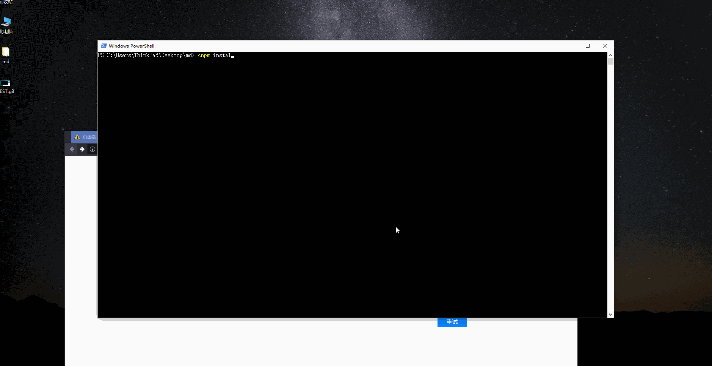
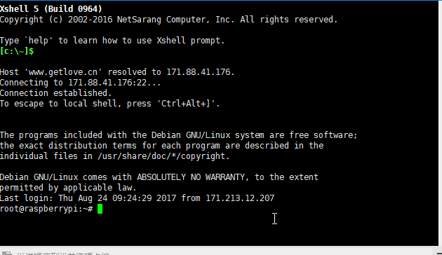

#使用md-http快速搭建博客

md-http是在2017年七月使用nodejs开发的通过http快速访问markdown的程序。依赖nodejs环境。

github:[https://github.com/liuyinglong/md-server](https://github.com/liuyinglong/md-server)  
npm:[https://www.npmjs.com/package/md-http](https://www.npmjs.com/package/md-http)

## install
	npm install md-http -g

## use

	md-http --path="your md path" --port 80

## options

- path  
markdown文件路径 默认当前目录
- port  
端口号 默认3000

## 快速开启服务

## pm2 启动
	pm2 start md-http -- --port 9003 --path="your/md/path"

